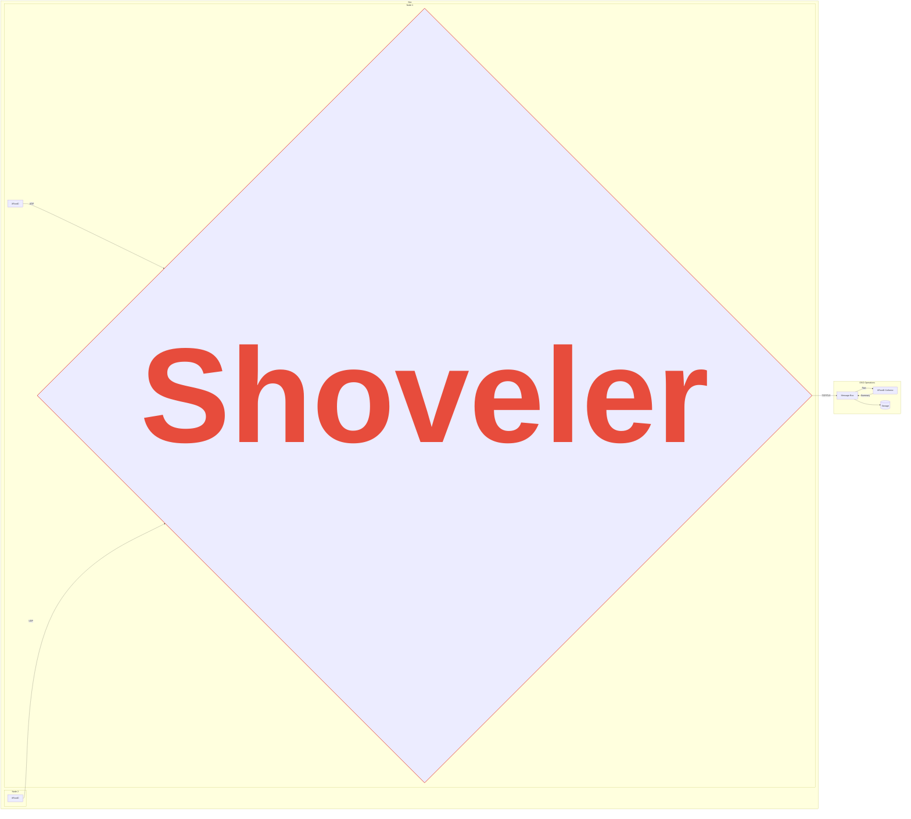

<div align="center">

  <h1>XRootD Monitoring Shoveler</h1>
  
  <p>
    This shoveler gathers UDP monitoring messages from XRootD servers and sends them to a reliable message bus.
  </p>

<!-- Badges -->
  <p>
    
    
    
    <a href="https://pkg.go.dev/github.com/opensciencegrid/xrootd-monitoring-shoveler">
       
    </a>
    <a href="https://github.com/opensciencegrid/xrootd-monitoring-shoveler/blob/main/LICENSE.txt">
       
    </a>
  </p>
 
  <h4>
    <a href="https://opensciencegrid.org/docs/data/xrootd/install-shoveler/">Documentation</a>
  <span> · </span>
    <a href="https://github.com/opensciencegrid/xrootd-monitoring-shoveler/issues/">Report Bug</a>
  <span> · </span>
    <a href="https://github.com/opensciencegrid/xrootd-monitoring-shoveler/issues/">Request Feature</a>
  </h4>
</div>



<!-- Table of Contents -->
# :notebook_with_decorative_cover: Table of Contents

- [:notebook\_with\_decorative\_cover: Table of Contents](#notebook_with_decorative_cover-table-of-contents)
  - [Getting Started](#getting-started)
    - [Requirements](#requirements)
    - [:gear: Installation](#gear-installation)
  - [Configuration](#configuration)
    - [Message Bus Credentials](#message-bus-credentials)
    - [Packet Verification](#packet-verification)
    - [IP Mapping](#ip-mapping)
  - [Running the Shoveler](#running-the-shoveler)
  - [:compass: Design](#compass-design)
    - [Queue Design](#queue-design)
  - [:warning: License](#warning-license)
  - [:gem: Acknowledgements](#gem-acknowledgements)

## Getting Started

### Requirements

1. An open UDP port from the XRootD servers, defaults to port 9993.  The port does not need to be open to the public 
   internet, only the XRootD servers.
2. Outgoing network access to connect to the message bus.
3. Disk space for a persistent message queue if the shoveler is disconnected from the message bus.
[Calculations](https://gist.github.com/djw8605/79b3b5a3f5b928f2f50ff469ce57d028) have shown production servers 
   generate <30 MB of data a day.

The shoveler can run on a dedicated server or on a shared server.  The shoveler does not require many resources.
For example, a shoveler serving 12 production XRootD servers can be expected to consume 10-50 MB of ram, 
and require a small fraction of a CPU.

### :gear: Installation

Binaries and packages are provided in the latest Github [releases](https://github.com/opensciencegrid/xrootd-monitoring-shoveler/releases).

## Configuration

The shoveler will read from:

1. Configuration file.
2. Environment Variables
3. Command line arguments.

An example configuration file, [config.yaml](config/config.yaml) is in the repo.  Each variable in the configuration 
file has a corresponding environment variable, listed below.  The environment variables are useful for deployment in 
docker or kubernetes.  By default, the config is stored in `/etc/xrootd-monitoring-shoveler`.

When running as a daemon, environment variables can still be used for configuration. The service will be looking for
them under `/etc/sysconfig/xrootd-monitoring-shoveler`.

Environment variables:

* SHOVELER_MQ
* SHOVELER_AMQP_TOKEN_LOCATION
* SHOVELER_AMQP_URL
* SHOVELER_AMQP_EXCHANGE
* SHOVELER_LISTEN_PORT
* SHOVELER_LISTEN_IP
* SHOVELER_VERIFY
* SHOVELER_QUEUE_DIRECTORY
* SHOVELER_STOMP_USER
* SHOVELER_STOMP_PASSWORD
* SHOVELER_STOMP_URL
* SHOVELER_STOMP_TOPIC
* SHOVELER_STOMP_CERT
* SHOVELER_STOMP_CERT_KEY
* SHOVELER_METRICS_PORT
* SHOVELER_METRICS_ENABLE
* SHOVELER_MAP_ALL

### Message Bus Credentials

When running using AMQP as the protocol to connect the shoveler uses a [JWT](https://jwt.io/) to authorize with the message bus.  The token will be issued by an 
automated process, but for now, long lived tokens are issued to sites. 

On the other hand, if STOMP is the selected protocol user and password will need to be provided when configuring the shoveler.

### Packet Verification

If the `verify` option or `SHOVELER_VERIFY` env. var. is set to `true` (the default), the shoveler will perform 
simple verification that the incoming UDP packets conform to XRootD monitoring packets.

### IP Mapping

When the shoveler runs on the same node as the XRootD server, or in the same private network, the IP of the incoming XRootD
packets may report the private IP address rather than the public IP address.  The public ip address is used for reverse
DNS lookup when summarizing the records.  You may map incoming IP addresses to other addresses with the `map` configuration value.

To map all incoming messages to a single IP:

```
map:
  all: <ip address>
```

or the environment variable SHOVELER_MAP_ALL=<ip address>

To map multiple ip addresses, the config file would be:
   
```
map:
   <ip address>: <ip address>
   <ip address>: <ip address>
   
```

## Running the Shoveler

The shoveler is a statically linked binary, distributed as an RPM and uploaded to docker hub and OSG's container hub.
You will need to configure the config.yaml before starting.

Install the RPM from the [latest release](https://github.com/opensciencegrid/xrootd-monitoring-shoveler/releases).  
Start the systemd service with:

    systemctl start xrootd-monitoring-shoveler.service

From Docker, you can start the container from the OSG hub with the following command.

    docker run -v config.yaml:/etc/xrootd-monitoring-shoveler/config.yaml hub.opensciencegrid.org/opensciencegrid/xrootd-monitoring-shoveler

## :compass: Design 

### Queue Design

The shoveler receives UDP packets and stores them onto a queue before being sent to the message bus.  100 messages 
are stored in memory.  When the in memory messages reaches over 100, the messages are written to disk under the 
`SHOVELER_QUEUE_DIRECTORY` (env) or `queue_directory` (yaml) configured directories.  A good default is 
`/var/spool/xrootd-monitoring-shoveler/queue`. Note that `/var/run` or `/tmp` should not be used, as these directories
 are not persistent and may be cleaned regularly by tooling such as `systemd-tmpfiles`.
The on-disk queue is persistent across shoveler restarts.

The queue length can be monitored through the prometheus monitoring metric name: `shoveler_queue_size`.

## :warning: License

Distributed under the [Apache 2.0](https://choosealicense.com/licenses/apache-2.0/) License. See LICENSE.txt for more information.


## :gem: Acknowledgements

This project is supported by the National Science Foundation under Cooperative Agreements [OAC-2030508](https://www.nsf.gov/awardsearch/showAward?AWD_ID=2030508) and [OAC-1836650](https://www.nsf.gov/awardsearch/showAward?AWD_ID=1836650).


